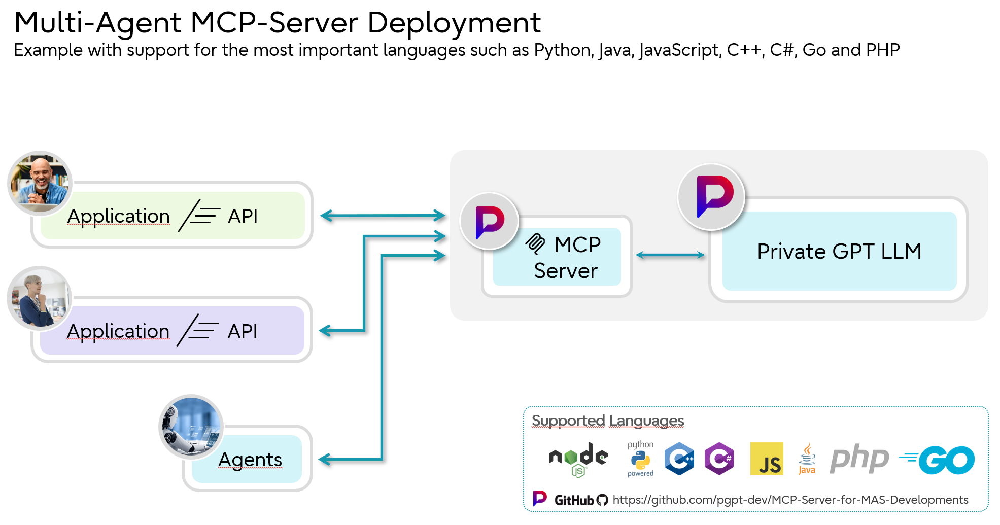

## Table of Contents
- [**PrivateGPT MCP Server**](#privategpt-mcp-server)
- [**What is MCP?**](#what-is-mcp)
  - [Why MCP?](#why-mcp)
  - [Why Agents](#why-agents)
  - [How it Works](#how-it-works) 
- [**Interaction Between Agents, LLMs, and MCP Servers**](#interaction-between-agents-llms-and-mcp-servers)
  - [Scenario](#scenario)
    1. [User Input](#user-input)
    2. [Agent Processing](#agent-processing)
    3. [LLM Interaction](#llm-interaction)
    4. [Response Processing](#response-processing)
    5. [Security and Logging](#security-and-logging)
- [**Advantages of Using Agents in This Context**](#advantages-of-using-agents-in-this-context)
  - [Modularity](#modularity)
  - [Security](#security)
  - [Efficiency](#efficiency)
  - [Flexibility](#flexibility)
- [**Overview**](#overview)
- [**Security Features Overview**](#security)
  - [1. Password Encryption](#1-password-encryption)
  - [2. Key Management](#2-key-management)
  - [3. Decryption on the Server](#3-decryption-on-the-server)
  - [4. Transport Layer Security (TLS)](#4-transport-layer-security-tls)
  - [5. Authorization Tokens](#5-authorization-tokens)
  - [6. Restriction of Key Generation (Keygen)](#6-restriction-of-key-generation-keygen)
  - [7. Certificate-Based Access Control (CBAC)](#7-certificate-based-access-control-cbac)
  - [8. Secure Configuration](#8-secure-configuration)
  - [9. Logging and Monitoring](#9-logging-and-monitoring)
  - [Summary](#summary)
  - [Encrypted Password Generation Tool](#encrypted-password-generation-tool)
    1. [Generate a password for the client and/or the server's Proxy_Config](#generate-encrypted-password)
    2. [Check the generated encrypted password](#check-the-generated-encrypted-password)
  - [Encrypted Password Decryption Tool](#encrypted-password-decryption-tool)
    1. [Check the generated encrypted password](#check-the-generated-encrypted-password)
- [**Feature Overview for PGPT Server**](#feature-overview-for-pgpt-server)
  - [1. Authentication and Authorization](#1-authentication-and-authorization)
  - [2. Chat Management](#2-chat-management)
  - [3. Group Management](#3-group-management)
  - [4. Source Management](#4-source-management)
  - [5. User Management](#5-user-management)
  - [6. Configuration Flexibility](#6-configuration-flexibility)
  - [7. Error Handling and Logging](#7-error-handling-and-logging)
  - [8. Security Features](#8-security-features)
  - [Example Use Cases](#example-use-cases)
  - [How to Use](#how-to-use)
- [**Installation**](#installation)
  - [Prerequisites](#prerequisites)
  - [Install Dependencies](#install-dependencies)
  - [Build the Project](#build-the-project)
- [**Configuration Description**](#configuration-description)
  - [Proxy Configuration](#proxy-configuration)
    - [Use Proxy](#use-proxy)
    - [Header Encryption](#header-encryption)
    - [Access Header](#access-header)
      - [Example Configuration](#example-configuration)
      - [Notes](#notes)
  - [Server Configuration](#server-configuration)
    - [Server Port](#server-port)
    - [Language](#language)
    - [SSL Validation](#ssl-validation)
    - [Encryption](#encryption)
  - [Restrictions](#restrictions)
    - [Group Restrictions](#restrictions)
	- [Enable OpenAI compatible API](#restrictions)
  - [Logging](#logging)
    - [Written Logfile](#logging)
    - [Log IPs](#logging)
    - [Anonymous Mode](#logging)
  - [Feature Activation/Deactivation](#feature-activationdeactivation)
    - [ENABLE_LOGIN](#feature-activationdeactivation)
    - [ENABLE_LOGOUT](#feature-activationdeactivation)
    - [ENABLE_CHAT](#feature-activationdeactivation)
    - [ENABLE_CONTINUE_CHAT](#feature-activationdeactivation)
    - [ENABLE_GET_CHAT_INFO](#feature-activationdeactivation)
    - [ENABLE_DELETE_ALL_CHATS](#feature-activationdeactivation)
    - [ENABLE_DELETE_CHAT](#feature-activationdeactivation)
    - [ENABLE_LIST_GROUPS](#feature-activationdeactivation)
    - [ENABLE_STORE_GROUP](#feature-activationdeactivation)
    - [ENABLE_DELETE_GROUP](#feature-activationdeactivation)
    - [ENABLE_CREATE_SOURCE](#feature-activationdeactivation)
    - [ENABLE_EDIT_SOURCE](#feature-activationdeactivation)
    - [ENABLE_DELETE_SOURCE](#feature-activationdeactivation)
    - [ENABLE_GET_SOURCE](#feature-activationdeactivation)
    - [ENABLE_LIST_SOURCES](#feature-activationdeactivation)
    - [ENABLE_STORE_USER](#feature-activationdeactivation)
    - [ENABLE_EDIT_USER](#feature-activationdeactivation)
    - [ENABLE_DELETE_USER](#feature-activationdeactivation)
    - [ENABLE_REACTIVATE_USER](#feature-activationdeactivation)
  - [Usage](#usage)
    - [Available Tools](#available-tools)
- [**Project Structure**](#project-structure)
- [License](#license)


# PrivateGPT MCP Server
A Model Context Protocol (MCP) server implementation that allows you to use PrivateGPT as an agent for your preferred MCP client. 
This enables seamless integration between PrivateGPT's powerful capabilities and any MCP-compatible application.

## What is MCP?
MCP is an open protocol that standardizes how applications provide context to LLMs. Think of MCP like a USB-C port for AI applications. Just as USB-C provides a standardized way to connect your devices to various peripherals and accessories, MCP provides a standardized way to connect AI models to different data sources and tools.

### Why MCP?
MCP helps you build agents and complex workflows on top of LLMs. LLMs frequently need to integrate with data and tools, and MCP provides:
- A growing list of pre-built integrations that your LLM can directly plug into
- The flexibility to switch between LLM providers and vendors
- Best practices for securing your data within your infrastructure

### How it Works
At its core, MCP follows a client-server architecture where a host application can connect to multiple servers:



- **MCP Hosts**: Programs like Applications, Claude Desktop, IDEs, or AI tools that want to access data through MCP
- **MCP Clients**: Protocol clients that maintain 1:1 connections with servers
- **MCP Servers**: Lightweight programs that each expose specific capabilities through the standardized Model Context Protocol
- **Local Data Sources**: Your computer's files, databases, and services that MCP servers can securely access
- **Remote Services**: External systems available over the internet (e.g., through APIs) that MCP servers can connect to

## Overview
This server provides a bridge between MCP clients and the PrivateGPT API, allowing you to:
- Chat with PrivateGPT using both public and private knowledge bases
- Create and manage knowledge sources
- Organize sources into groups
- Control access through group-based permissions


---

# Why Agents
An **agent** in relation to **LLMs** (Large Language Models) and **MCP servers** is a specialized software component that acts as an intermediary between language models and applications. It handles tasks such as processing requests, interacting with the LLM via MCP, managing workflows, ensuring security and efficiency within the overall system, and much more. By utilizing agents, complex AI-based applications can be designed to be effective, secure, and scalable.
**The code for agents in this repsoitory can be used to implement it into own solutions / applications.**

## Interaction Between Agents, LLMs, and MCP Servers
The interaction of these components enables the development of powerful, scalable, and secure AI applications. Below is a simplified scenario that illustrates this interaction:

1. **User Input:** A user sends a request through a user interface hosted on the MCP server.
2. **Agent Processing:** An agent on the MCP server receives the request, validates it, and prepares it for the LLM.
3. **LLM Interaction:** The agent forwards the request to the LLM, which generates a response.
4. **Response Processing:** The agent receives the response from the LLM, processes it further if necessary (e.g., formatting, integration with other data sources), and sends it back to the user.
5. **Security and Logging:** During this process, the agent monitors interactions, ensures that security policies are adhered to, and logs relevant information for later analysis.

## Advantages of Using Agents in This Context
- **Modularity:** Agents allow for a clear separation of responsibilities, making the system easier to maintain and scale.
- **Security:** Centralized management of access and monitoring of activities help minimize security risks.
- **Efficiency:** Automated agents can perform tasks faster and more consistently than manual processes.
- **Flexibility:** Agents can be easily adapted or extended to support new functions or changes in business requirements.

### Importance of Encrypting Passwords
In any application handling sensitive data, security is paramount. This server manages two critical sets of credentials:
1. **Proxy Headers:** Used by for example HAProxy to authenticate and manage traffic.
2. **LLM Access Passwords:** Used to secure access to the large language models.

Storing these passwords in plaintext poses significant security risks, including unauthorized access and potential data breaches. 
To mitigate these risks, it is essential to encrypt these passwords and handle only their ciphertext within the system.

### Benefits of Using Ciphertext Only
- **Enhanced Security:** Even if an attacker gains access to the configuration files or environment variables, encrypted passwords remain unintelligible without the corresponding decryption keys.
- **Compliance:** Encryption helps in adhering to security standards and regulations that mandate the protection of sensitive information.
- **Integrity:** Ensures that passwords cannot be tampered with, maintaining the integrity of the authentication mechanisms.

---

# Security
The following security features are implemented to ensure data protection and secure communication between the client application and server. These features cover encryption, decryption, key management, and transport security.

## 1. Password Encryption
Passwords can be encrypted using RSA (Rivest–Shamir–Adleman) public-key cryptography. This ensures that sensitive data, such as user passwords, are never transmitted in plaintext.

### Method
- **Public key encryption** with a **2048-bit key length**.
- **Padding**: `RSA_PKCS1_PADDING` to enhance security and prevent known padding attacks.

### Process
1. The server administrator encrypts the client's password using the server's public key (`id_rsa_public.pem`) by executing `node security/generate_encrypted_password.js ~/.ssh/id_rsa_public.pem` and hand out the encrpyted password to the client.
2. Alternatively: The client encrypts the password using the server's public key (`id_rsa_public.pem`) by using the `keygen` - Function. Therefore the function has to be enabled in the server's config (`pgpt.env.json`). Important: Using this function also means transmitting data via the network. Therefore, make sure that the data traffic is secure and cannot be intercepted.
3. Finally, the encrypted password is sent to the server, where it is decrypted using the server's private key.

### Advantages
- **Asymmetric encryption** ensures that only the server can decrypt the password.
- Even if the communication channel is compromised, encrypted data remains secure.

## 2. Key Management
To secure data communication and encryption processes, the following key management principles are followed:

### Public Key
- Stored securely on the server (`id_rsa.pub`).
- Used only for encryption and does not pose a security risk if exposed.

### PEM Key
- Stored securely on the server (`id_rsa_public.pem`).
- Has to be created by using the public cert (see: [Server Configuration](#server-configuration))

### Private Key
- Stored securely on the server (`id_rsa`).
- Restricted access with appropriate file permissions (`chmod 600`).
- Used exclusively for decryption operations.

### Key Rotation
- Keys are rotated periodically or upon detection of a security incident.
- Old keys are securely invalidated.

## 3. Decryption on the Server
Decryption is exclusively performed on the server using the private key:

### Process
1. The server receives the encrypted password from the client.
2. The private key decrypts the password to retrieve the original plaintext.
3. The decrypted password is used internally (e.g., authentication) and never stored in plaintext.

### Secure Handling
- Decrypted passwords exist in memory only for the duration of processing.
- Secure memory management practices ensure sensitive data is cleared immediately after use.

## 4. Transport Layer Security (TLS)
To secure communication between the client and server:

### TLS Encryption
- All data transmitted between the client and server is encrypted using TLS (minimum version 1.2).
- Prevents man-in-the-middle (MITM) attacks and eavesdropping.

### Certificate Validation
- Certificates are validated on both sides to ensure the authenticity of the server and client.
- Optionally, mutual TLS can be enabled for enhanced security.

## 5. Authorization Tokens
Tokens are used to authenticate requests and ensure only authorized users can access the system:

### Token Management
- Tokens are generated upon successful login.
- They are short-lived and automatically expire after a predefined time.
- Tokens are signed using HMAC or RSA, making them tamper-proof.

### Secure Storage
- Tokens are stored securely on the client side (e.g., in memory or encrypted storage).

## 6. Restriction of Key Generation (Keygen)
To prevent misuse of the system, key generation (`keygen`) is restricted:

### Configuration
- The server has a configuration option (`ALLOW_KEYGEN`) to enable or disable key generation.
- Attempts to call the keygen function when disabled result in an error message.

### Audit Logging
- All keygen operations are logged for auditing and monitoring purposes.

## 7. Certificate-Based Access Control (CBAC)
- As the agent does not require a password when certificate authentication is activated and logs on to the server using a key, it is automatically locked to this server. 
If it would want to log in to another MCP PGPT server, this login attempt is rejected as the key is checked against the server's private certificate. 

### Features
- Functions such as `keygen`, `store_user`, and `edit_source` are only accessible to authorized roles.
- Unauthorized access attempts are denied with detailed error messages.

### Configuration
- Enabled or disabled functions can be specified in the server's configuration (`Functions` object).

## 8. Secure Configuration
The server configuration contains several security-related options:

### SSL_VALIDATE
- Validates SSL/TLS certificates to ensure secure communication.
- Can be enabled or disabled based on environment requirements (e.g., testing vs. production).

### PW_ENCRYPTION
- Enables or disables password encryption.
- Ensures compatibility in environments where encryption is not feasible.

## 9. Logging and Monitoring
All security-related events are logged for monitoring and troubleshooting:

### Logged Events
- Failed login attempts.
- Key generation requests.
- Unauthorized access attempts.
- Encryption and decryption errors.


## Summary
The implemented security features ensure:

- **Confidentiality** of sensitive data through encryption and secure transport.
- **Integrity** of operations using robust key management and token validation.
- **Role-based and configurable access control** for system functions.
- **Comprehensive monitoring** for proactive detection and response to security threats.

These measures collectively provide a secure environment for client-server communication and data handling.


# Feature Overview for PGPT Server
The PGPT Server offers a robust set of features designed to provide efficient, flexible, and secure communication with the Model Context Protocol (MCP). Below is an overview of the key features and functionalities available in the server.

---

## Key Features

### 1. **Authentication and Authorization**
- **Login Functionality**: Authenticate users with email and password to generate access tokens.
- **Logout Functionality**: Securely invalidate user tokens to end sessions.

---

### 2. **Chat Management**
- **Start a Chat**: Initiate a conversation with the server, optionally using public knowledge bases or specific group contexts.
- **Continue a Chat**: Resume an ongoing conversation by providing the chat ID and a follow-up message.
- **Retrieve Chat Information**: Fetch metadata and messages for a specific chat by its ID.
- **Delete all Chats**: Deletes the previous chat histories of the executing user (chat history).
- **Delete Chat**: Deletes the current chat of the executing user.

---

### 3. **Group Management**
- **List Groups**: View personal and assignable groups available to the user.
- **Create Groups**: Add new groups with names and descriptions for organizational purposes.
- **Delete Groups**: Remove existing groups (if enabled in configuration).

---

### 4. **Source Management**
- **Create Sources**: Add new sources with content and assign them to specific groups.
- **Edit Sources**: Update existing sources with new content or metadata.
- **Delete Sources**: Remove sources that are no longer needed.
- **Retrieve Sources**: Fetch information about a specific source by its ID.
- **List Sources**: View all sources assigned to a specific group.

---

### 5. **User Management**
- **Create Users**: Register new users with customizable roles, groups, and settings.
- **Edit Users**: Update user information, including name, email, password, and roles.
- **Delete Users**: Remove users from the system (if enabled in configuration).
- **Reactivate User**: Reactivate a user who was previously deactivated.

---

### 6. **Configuration Flexibility**
- **Function Activation/Deactivation**: Enable or disable individual server functionalities through the `.env` configuration file.
- **Language Support**: Customize the server's system messages to your preferred language (e.g., English or German).
- **SSL Validation**: Toggle SSL validation for secure connections to the server.

---

### 7. **Error Handling and Logging**
- Detailed error messages and logging for:
  - Invalid requests
  - Authentication failures
  - API communication issues
- Configurable responses when a disabled function is accessed.

---

### 8. **Security Features**
- **Token-Based Authentication**: Ensures secure and controlled access to server features.
- **Restricted Group Access**: Option to limit access to `assignableGroups` for enhanced privacy.

---

### Example Use Cases
1. **Customer Support**: Use chat features to build intelligent conversational agents.
2. **Knowledge Management**: Manage and retrieve structured data with sources and groups.
3. **Multi-User Collaboration**: Create, edit, and assign users to groups for collaborative workflows.
4. **Customizable Functionality**: Activate only the features you need for your application.

---

### How to Use
1. Copy the `pgpt.env.json.example` file to `pgpt.env.json` e.g. with  `cp .\pgpt.env.json.example .\pgpt.env.json`
2. Configure the server by editing the `pgpt.env.json` file.
3. Start the server using the provided script.
4. Interact with the server via API calls to utilize its features.

Refer to the **API Documentation** for detailed usage instructions and examples for each endpoint.

---

The PGPT Server is a powerful tool for managing structured communication and data in a customizable environment. Tailor its features to your needs for maximum efficiency and control.


## Installation
1. Clone the repository:
```bash
git clone https://github.com/pgpt-dev/MCP-Server-for-MAS-Developments.git
cd MCP-Server-for-MAS-Developments
```

**Now you have to choose: Manually or automatic.**

### `Manually step-by-step Installation`
2. Install `npm`, for example:
```bash
sudo apt install npm
```
3. Install Dependencies
```bash
npm install
```
4. Build the project:
```bash
npm run build
```

### `or Automatic Installation`
2. Make `InstallMPCServer.sh` executable (Linux):
```bash
sudo chmod +x InstallMPCServer.sh
```

3. Run the Script and you're done. Watch out for error messages and make sure everything is ok.
```bash
./InstallMPCServer.sh
```
---

## Configuration Description

### Proxy Configuration
This section provides detailed explanations for the `Proxy_Config` settings used in the system.

### `Use Proxy`
If a Proxy is used, you have to define a Header for authentication at the Proxy.

| Key             | Description                                              | Example Value |
|-----------------|----------------------------------------------------------|---------------|
| **USE_PROXY**   |Determines whether the application should route           | `true`        |
|                 |requests through a proxy server.                          |               |

Example configuration of a HAProxy's backend. Only request contaning `1234567890ABCDEFHIJ` in the header will be accepted:

```bash
backend mcpserver.mydomain.com
    acl valid_header req.hdr(X-Custom-Header) -m str "1234567890ABCDEFHIJ"
    http-request deny unless valid_header
    http-request del-header X-Custom-Header
    server stable 172.16.123.4:443 ssl verify none
```

---

### `Header Encryption`
| Key                    | Description                                              | Example Value |
|------------------------|----------------------------------------------------------|---------------|
| **HEADER_ENCRYPTED**   |Indicates if the custom proxy access header is encrypted. | `true`        |

  - `"true"`: The access header is encrypted. Use the encryption tool in the security folder on the server to encrypt the Header.
  - `"false"`: The access header is plain text.
  
---

### `Access Header`
The custom header value used for proxy authentication or access control. If `HEADER_ENCRYPTED` is `"true"`, this value must be decrypted before use.


| Key                | Description                                          | Example Value |
|--------------------|------------------------------------------------------|---------------|
| **ACCESS_HEADER**  | Used for proxy authentication or access control.     | `123abc..`    |


## Notes
- Ensure that `ACCESS_HEADER` is properly secured if `HEADER_ENCRYPTED` is set to `"true"`.
- Double-check proxy server settings to avoid connectivity issues.

---

### Server Configuration
For secure certificate authentification, create a `.env` file with your PrivateGPT credentials, for example pgpt.env.json 
Settings can be adjusted in the `.env` file to customize the server and its functionalities.

Generate the certificates (if you haven't ssh certificates use `ssh-keygen -t rsa`), .pem files are needed:
```bash
ssh-keygen -p -m PEM -f ~/.ssh/id_rsa
ssh-keygen -f ~/.ssh/id_rsa.pub -e -m PEM > ~/.ssh/id_rsa_public.pem
```

After this process, you can create Ciphertext from passwords by using the Encrypted Password Encryption Tool and test the cipher with the Encrypted Password Decryption Tool.
You will find the descriptionof how it works in the `Security` section of this document.

---

Below is a sample `.env` configuration file for the PGPT server, including descriptions for each setting. 
Customize these values to fit your environment and requirements.

---

## `Server Port`
| Key      | Description                                    | Example Value |
|----------|------------------------------------------------|---------------|
| **PORT** | The port on which the MCP server runs.         | `5000`        |

---

## `Language`
The system supports out-of-the-box: `de`, `en`, `pt`, `es`, `nl`, `fr`.
Every Language can be easily added by modifying the `pgpt-messages.js`. This file should be stored after the modification in `/src` as well as in `/dist`.

| Key        | Description                                                         | Example Value |
|------------|---------------------------------------------------------------------|---------------|
| **LANGUAGE** | The language for the server's system messages (`en` or `de`).     | `"de"`        |

---

## `SSL Validation`
| Key            | Description                                                                             | Example Value |
|----------------|-----------------------------------------------------------------------------------------|---------------|
| **SSL_VALIDATE** | Use `"false"` only if the server's certificate cannot be validated by the client.     | `"false"`     |

---

## `Encryption`
| Key               | Description                                                                          | Example Value                    |
|-------------------|--------------------------------------------------------------------------------------|----------------------------------|
| **PW_ENCRYPTION** | If set to `"true"` the server only accepts passwords in Ciphertext.                  | `"false"`                        |
| **PUBLIC_KEY**    | Specifies the file system path to the server's public PEM file used for SSL/TLS.     | `"~/.ssh/id_rsa_public.pem"`     |
| **PRIVATE_KEY**   | Specifies the file system path to the server's private key file used for decryption. | `"~/.ssh/id_rsa_public.pem"`     |


---

## `Restrictions`
| Key                         | Description                                                                                     | Example Value |
|-----------------------------|-------------------------------------------------------------------------------------------------|---------------|
| **RESTRICTED_GROUPS**       | Setting `true` prevents client access to `assignableGroups`.                                    | `true`        |
| **ENABLE_OPEN_AI_COMP_API** | Setting `true` allows the compatibility mode for OpenAI API.                                    | `false`       |

---
    
## `Logging`
| Key                 | Description                                                                                                                                                             | Example Value |
|---------------------|-------------------------------------------------------------------------------------------------------------------------------------------------------------------------|---------------|
| **WRITTEN_LOGFILE** | Enable logfile. If set to `false`, no logfile `logs/server.log` will be written. If this option is set to ‘true’, the log can be retrieved via <ip>:3000 of the server. | `true`        |
| **LOG_IPs**         | Log IP's of the cleints/agents. If it is set to `false`, this information is replaced by `*****` and cannot be restored.                                                | `false`       |
| **ANONYMOUS_MODE**  | Deactivate everything that has to do with logging. No communication, errors or similar are written/saved or displayed.                                                  | `false`       |


## `Feature Activation/Deactivation`
Control the availability of individual server functions. Set the corresponding value to `true` to enable the function, or `false` to disable it. Disabled functions will return a message indicating they are not available.

| Key                          | Description                                        | Example Value |
|------------------------------|----------------------------------------------------|---------------|
| **ENABLE_LOGIN**             | Enables or disables the login function.            | `true`        |
| **ENABLE_LOGOUT**            | Enables or disables the logout function.           | `true`        |
| **ENABLE_CHAT**              | Enables or disables the chat functionality.        | `true`        |
| **ENABLE_CONTINUE_CHAT**     | Enables or disables continuing a chat.             | `true`        |
| **ENABLE_GET_CHAT_INFO**     | Enables or disables retrieving chat information.   | `true`        |
| **ENABLE_DELETE_ALL_CHATS**  | Enables or disables retrieving chat information.   | `true`        |
| **ENABLE_DELETE_CHAT**       | Enables or disables retrieving chat information.   | `true`        |
| **ENABLE_LIST_GROUPS**       | Enables or disables listing groups.                | `true`        |
| **ENABLE_STORE_GROUP**       | Enables or disables creating a group.              | `true`        |
| **ENABLE_DELETE_GROUP**      | Enables or disables deleting a group.              | `false`       |
| **ENABLE_CREATE_SOURCE**     | Enables or disables creating a source.             | `true`        |
| **ENABLE_EDIT_SOURCE**       | Enables or disables editing a source.              | `true`        |
| **ENABLE_DELETE_SOURCE**     | Enables or disables deleting a source.             | `true`        |
| **ENABLE_GET_SOURCE**        | Enables or disables retrieving a source.           | `true`        |
| **ENABLE_LIST_SOURCES**      | Enables or disables listing sources.               | `true`        |
| **ENABLE_STORE_USER**        | Enables or disables creating a user.               | `true`        |
| **ENABLE_EDIT_USER**         | Enables or disables editing a user.                | `false`       |
| **ENABLE_DELETE_USER**       | Enables or disables deleting a user.               | `false`       |
| **ENABLE_REACTIVATE_USER**   | Enables or disables reactivating a user.           | `false`       |

---

## Usage
- **Enable a Function**: Set the corresponding value in the `.env` file to `true`.
- **Disable a Function**: Set the corresponding value in the `.env` file to `false`.
  - The server will respond with a message indicating that the function is disabled.

Example `.env` entry:
```dotenv
{
    "PGPT_Url": {
        "PRIVATE_GPT_API_URL": "https://<YOUR_PGPT_URL>/api/v1",
        "API_URL": "https://<YOUR_PGPT_URL>/api/v1"
    },
    "Proxy_Config": {
        "USE_PROXY": "true",
        "HEADER_ENCRYPTED": "true",
        "ACCESS_HEADER": "Example: BptfJBeRGLbZas+..."
    },
    "Server_Config": {
        "PORT": 5000,
        "LANGUAGE": "en",
        "SSL_VALIDATE": "false",
        "PW_ENCRYPTION": "true",
        "ALLOW_KEYGEN": "false",
        "PUBLIC_KEY": "~/.ssh/id_rsa_public.pem",
        "PRIVATE_KEY": "~/.ssh/id_rsa"
    },
    "Restrictions": {
        "RESTRICTED_GROUPS": false,
        "ENABLE_OPEN_AI_COMP_API": true
    },
    "Logging": {
        "WRITTEN_LOGFILE": true,
        "LOG_IPs": true,
        "ANONYMOUS_MODE": false
    },
    "Functions": {
        "ENABLE_LOGIN": true,
        "ENABLE_LOGOUT": true,
        "ENABLE_CHAT": true,
        "ENABLE_CONTINUE_CHAT": true,
        "ENABLE_GET_CHAT_INFO": true,
        "ENABLE_DELETE_ALL_CHATS": true,
        "ENABLE_DELETE_CHAT": true,
        "ENABLE_LIST_GROUPS": true,
        "ENABLE_STORE_GROUP": true,
        "ENABLE_DELETE_GROUP": true,
        "ENABLE_CREATE_SOURCE": true,
        "ENABLE_EDIT_SOURCE": true,
        "ENABLE_DELETE_SOURCE": true,
        "ENABLE_GET_SOURCE": true,
        "ENABLE_LIST_SOURCES": true,
        "ENABLE_STORE_USER": true,
        "ENABLE_EDIT_USER": false,
        "ENABLE_DELETE_USER": false,
        "ENABLE_REACTIVATE_USER": true
    }
}
```

## Usage
Start the server:
```bash
node dist/index.js
```

The server will start and listen on stdio for MCP commands.

## Error Handling
The server handles various error scenarios:
- Authentication failures
- Network errors
- Invalid requests
- API errors
- Rate limiting
- Timeout errors

Errors are mapped to appropriate MCP error codes and include detailed messages for debugging.

## Available Tools

### Generate Encrypted Password
Generate a password for the client and/or the server's Proxy_Config->Password entry:
```bash
 node security/generate_encrypted_password.js ~/.ssh/id_rsa_public.pem
```

### Check the generated encrypted password
To check the encrytion use:
```bash
 node security/generate_decrypted_password.js ~/.ssh/id_rsa
```

See the sections `Encrypted Password Generation Tool` and `Encrypted Password Decryption Tool` below for further information

---

# Encrypted Password Generation Tool

## Overview
The **Encrypted Password Generation Tool** is a Node.js script designed to securely encrypt user passwords using RSA public-key cryptography. This tool ensures that sensitive password data remains protected during transmission and storage by leveraging robust encryption mechanisms. It is an essential component for systems requiring secure password handling and transmission between clients and servers.

## Features
- **Secure Encryption:** Utilizes RSA (Rivest–Shamir–Adleman) public-key cryptography to encrypt sensitive passwords.
- **User-Friendly Interface:** Prompts users to input their passwords securely via the command line.
- **Error Handling:** Provides comprehensive error messages for missing keys or encryption issues.
- **Flexible Integration:** Can be integrated into larger systems requiring secure password handling and encryption.

## How It Works
1. **Public Key Loading:** The script loads the RSA public key from a specified file path provided as a command-line argument.
2. **Password Input:** It prompts the user to enter their password securely via the command line.
3. **Encryption Process:** Using the loaded public key and `RSA_PKCS1_PADDING`, the script encrypts the entered password.
4. **Output:** The encrypted password is displayed in Base64 format, ready for secure transmission or storage.

## Prerequisites
- **Node.js:** Ensure that Node.js is installed on your system. You can download it from the [Node.js Official Website](https://nodejs.org/).
- **RSA Public Key:** You must have access to the RSA public key (`id_rsa_public.pem`) used for encrypting the password.

## Installation
-  **Install Dependencies:**
    The script uses built-in Node.js modules, so no additional dependencies are required. However, ensure that your Node.js version supports ES6 modules.
    ```bash
    rm -rf node_modules package-lock.json
    npm cache clean --force
    npm install
    ```

## Usage
1. **Prepare Your RSA Public Key:**
    Ensure you have your RSA public key (`id_rsa_public.pem`) stored securely on your MCP server.

2. **Run the Script, you will find it at the `security` directory of the MCP server:**
    Execute the script using Node.js, providing the path to your public key as a command-line argument.
    ```bash
    node encrypt_password.js /path/to/your/id_rsa_public.pem
    ```

    **Example:**
    ```bash
    node security/encrypt_password.js ~/.ssh/id_rsa_public.pem
    ```

3. **Enter Your Password:**
    When prompted, input your password securely.
    ```bash
    Please enter your password: ********
    ```

4. **View the Encrypted Password:**
    The script will output the encrypted password in Base64 format.
    ```bash
    Encrypted Password: <Your_Encrypted_Password>
    ```

---

# Encrypted Password Decryption Tool

## Overview
The **Encrypted Password Decryption Tool** is a Node.js script designed to securely decrypt encrypted passwords using RSA private-key cryptography. 
This tool ensures that sensitive password data remains protected during transmission and storage by leveraging robust encryption and decryption mechanisms.
To verify or decrypt an encrypted password, use the private key. This is helpful to ensure that the encryption was performed correctly.

## Features
- **Secure Decryption:** Utilizes RSA (Rivest–Shamir–Adleman) private-key cryptography to decrypt sensitive password data.
- **Error Handling:** Provides comprehensive error messages for missing keys or decryption issues.
- **User-Friendly Interface:** Prompts users to input encrypted passwords securely via the command line.
- **Flexible Integration:** Can be integrated into larger systems requiring secure password handling.

## How It Works
1. **Private Key Loading:** The script loads the RSA private key from a specified file path provided as a command-line argument.
2. **Encrypted Password Input:** It prompts the user to enter an encrypted password in Base64 format.
3. **Decryption Process:** Using the loaded private key and RSA_PKCS1_PADDING, the script decrypts the encrypted password.
4. **Output:** The decrypted plaintext password is displayed in the console.

## Prerequisites
- **Node.js:** Ensure that Node.js is installed on your system. You can download it from [Node.js Official Website](https://nodejs.org/).
- **RSA Private Key:** You must have access to the RSA private key (`id_rsa`) on your MCP server used for decrypting the password.

## Installation
- **Install Dependencies:**
    The script uses built-in Node.js modules, so no additional dependencies are required. However, ensure that your Node.js version supports ES6 modules.

## Usage
1. **Prepare Your RSA Private Key:**
    Ensure you have your RSA private key (`id_rsa`) stored securely on your machine.

2. **Run the Script, you will find it at the `security` directory of the MCP server:**:**
    Execute the script using Node.js, providing the path to your private key as a command-line argument.
    ```bash
    node decrypt_password.js /path/to/your/id_rsa
    ```

    **Example:**
    ```bash
    node decrypt_password.js ~/.ssh/id_rsa
    ```

3. **Enter the Encrypted Password:**
    When prompted, input the encrypted password in Base64 format.
    ```bash
    Please enter the encrypted password: <Your_Encrypted_Password>
    ```

4. **View the Decrypted Password:**
    The script will output the decrypted plaintext password.
    ```bash
    Decrypted Password: your_plaintext_password
    ```
This will decrypt the encrypted password and display the original value.


### Notes
- Ensure that the `~/.ssh/id_rsa_public.pem` (public key) and `~/.ssh/id_rsa` (private key) files exist and have the correct permissions.
- The encryption tool relies on the public key, while the decryption tool requires the private key.

## Project Structure

### MCP Server for MAS Developments – Complete Project Overview
This repository contains the **MCP Server** and all related **client implementations**.  
Below you will find a **complete directory structure** as listed from the project root, including:
- `clients` (C# .Net, C++, Go, Java, JavaScript, PHP, Python),
- `dist`,
- `docs`,
- `logs`,
- `security`,
- `src`,
- `tests`,
- `ver`,
and all subfolders/files.

> **Note:**  
> This is a direct **directory listing** with minimal commentary.  

---

### Project Structure (Full Listing)
```text
MCP-Server-for-MAS-Developments/
├── dist
│   └── public
│       ├── index.html
│       └── pgpt-mcp-logo.png
├── docs
│   └── images
│       ├── alternative mcp client.png
│       ├── mcp-general-architecture.png
│       └── pGPT-MCP.png
├── logs
├── security
│   ├── generate_decrypted_password.js
│   └── generate_encrypted_password.js
├── src
│   ├── index.js
│   ├── logger.js
│   ├── pgpt-messages.js
│   ├── public
│   │   ├── index.html
│   │   └── pgpt-mcp-logo.png
│   ├── services
│   │   └── pgpt-service.ts
│   └── types
│       └── api.ts
├── tests
├── ver
│   ├── index_np.js
│   └── index_proxy_np.js
└── clients
    ├── C# .Net
   │   ├── 1.0 mcp_login
   │   │   ├── bin
   │   │   │   └── Debug
   │   │   │       └── net9.0
   │   │   ├── obj
   │   │   │   └── Debug
   │   │   │       └── net9.0
   │   │   ├── mcp_login.csproj
   │   │   └── Program.cs
   │   ├── 1.1 mcp_logout
   │   │   ├── bin
   │   │   │   └── Debug
   │   │   │       └── net9.0
   │   │   ├── obj
   │   │   │   └── Debug
   │   │   │       └── net9.0
   │   │   ├── mcp_logout.csproj
   │   │   └── Program.cs
   │   ├── 2.0 mcp_chat
   │   │   ├── bin
   │   │   │   └── Debug
   │   │   │       └── net9.0
   │   │   ├── obj
   │   │   │   └── Debug
   │   │   │       └── net9.0
   │   │   ├── mcp_chat.csproj
   │   │   └── Program.cs
   │   ├── 2.1 mcp_continue_chat
   │   ├── 2.2 mcp_get_chat_info
   │   ├── 3.0 mcp_create_source
   │   ├── 3.1 mcp_get_source
   │   ├── 3.2 mcp_list_sources
   │   ├── 3.3 mcp_edit_source
   │   ├── 3.4 mcp_delete_source
   │   ├── 4.0 mcp_list_groups
   │   ├── 4.1 mcp_store_group
   │   ├── 4.2 mcp_delete_group
   │   ├── 5.0 mcp_store_user
   │   ├── 5.1 mcp_edit_user
   │   ├── 5.2 mcp_delete_user
   │   ├── Code Archiv
   │   │   ├── mcp_chat.cs
   │   │   ├── mcp_continue_chat.cs
   │   │   ├── ...
   │   │   └── mcp_store_user.cs
   │   └── README.md  (14,924 bytes)
   ├── C++
   │   ├── 1.0 mcp_login
   │   │   ├── MCPLoginClient.cpp
   │   │   └── MCPLoginClient.exe
   │   ├── 1.1 mcp_logout
   │   ├── 2.0 mcp_chat
   │   ├── 2.1 mcp_continue_chat
   │   ├── 2.2 mcp_get_chat_info
   │   ├── 3.0 mcp_create_source
   │   ├── 3.1 mcp_get_source
   │   ├── 3.2 mcp_list_sources
   │   ├── 3.3 mcp_edit_source
   │   ├── 3.4 mcp_delete_source
   │   ├── 4.0 mcp_list_groups
   │   ├── 4.1 mcp_store_group
   │   ├── 4.2 mcp_delete_group
   │   ├── 5.0 mcp_store_user
   │   ├── 5.1 mcp_edit_user
   │   ├── 5.2 mcp_delete_user
   │   ├── 9.0 mcp_keygen
   │   └── README.md  (15,109 bytes)
   ├── Go
   │   ├── 1.0 mcp_login
   │   │   ├── MCPLoginClient.go
   │   │   └── MCPLoginClient.exe
   │   ├── 1.1 mcp_logout
   │   ├── 2.0 mcp_chat
   │   ├── 2.1 mcp_continue_chat
   │   ├── 2.2 mcp_get_chat_info
   │   ├── 3.0 mcp_create_source
   │   ├── 3.1 mcp_get_source
   │   ├── 3.2 mcp_list_sources
   │   ├── 3.3 mcp_edit_source
   │   ├── 3.4 mcp_delete_source
   │   ├── 4.0 mcp_list_groups
   │   ├── 4.1 mcp_store_group
   │   ├── 4.2 mcp_delete_group
   │   ├── 5.0 mcp_store_user
   │   ├── 5.1 mcp_edit_user
   │   ├── 5.2 mcp_delete_user
   │   ├── 9.0 mcp_keygen
   │   └── README.md  (14,903 bytes)
   ├── Java
   │   ├── 1.0 mcp_login
   │   │   ├── json-20241224.jar
   │   │   ├── MCPLoginClient.class
   │   │   └── MCPLoginClient.java
   │   ├── 1.1 mcp_logout
   │   ├── 2.0 mcp_chat
   │   ├── 2.1 mcp_continue_chat
   │   ├── 2.2 mcp_get_chat_info
   │   ├── 3.0 mcp_create_source
   │   ├── 3.1 mcp_get_source
   │   ├── 3.2 mcp_list_sources
   │   ├── 3.3 mcp_edit_source
   │   ├── 3.4 mcp_delete_source
   │   ├── 4.0 mcp_list_groups
   │   ├── 4.1 mcp_store_group
   │   ├── 4.2 mcp_delete_group
   │   ├── 5.0 mcp_store_user
   │   ├── 5.1 mcp_edit_user
   │   ├── 5.2 mcp_delete_user
   │   └── README.md  (16,208 bytes)
   ├── JavaScript
   │   ├── 1.0 mcp_login
   │   │   └── MCPLoginClient.js
   │   ├── 1.1 mcp_logout
   │   ├── 2.0 mcp_chat
   │   ├── 2.1 mcp_continue_chat
   │   ├── 2.2 mcp_get_chat_info
   │   ├── 3.0 mcp_create_source
   │   ├── 3.1 mcp_get_source
   │   ├── 3.2 mcp_list_sources
   │   ├── 3.3 mcp_edit_source
   │   ├── 3.4 mcp_delete_source
   │   ├── 4.0 mcp_list_groups
   │   ├── 4.1 mcp_store_group
   │   ├── 4.2 mcp_delete_group
   │   ├── 5.0 mcp_store_user
   │   ├── 5.1 mcp_edit_user
   │   ├── 5.2 mcp_delete_user
   │   ├── 9.0 mcp_keygen
   │   └── README.md  (15,692 bytes)
   ├── PHP
   │   ├── 1.0 mcp_login
   │   │   └── MCPLoginClient.php
   │   ├── 1.1 mcp_logout
   │   ├── 2.0 mcp_chat
   │   ├── 2.1 mcp_continue_chat
   │   ├── 2.2 mcp_get_chat_info
   │   ├── 3.0 mcp_create_source
   │   ├── 3.1 mcp_get_source
   │   ├── 3.2 mcp_list_sources
   │   ├── 3.3 mcp_edit_source
   │   ├── 3.4 mcp_delete_source
   │   ├── 4.0 mcp_list_groups
   │   ├── 4.1 mcp_store_group
   │   ├── 4.2 mcp_delete_group
   │   ├── 5.0 mcp_store_user
   │   ├── 5.1 mcp_edit_user
   │   ├── 5.2 mcp_delete_user
   │   ├── 9.0 mcp_keygen
   │   └── README.md  (15,636 bytes)
   └── Python
       ├── 1.0 mcp_login
       │   └── MCPLoginClient.py
       ├── 1.1 mcp_logout
       ├── 2.0 mcp_chat
       ├── 2.1 mcp_continue_chat
       ├── 2.2 mcp_get_chat_info
       ├── 3.0 mcp_create_source
       ├── 3.1 mcp_get_source
       ├── 3.2 mcp_list_sources
       ├── 3.3 mcp_edit_source
       ├── 3.4 mcp_delete_source
       ├── 4.0 mcp_list_groups
       ├── 4.1 mcp_store_group
       ├── 4.2 mcp_delete_group
       ├── 5.0 mcp_store_user
       ├── 5.1 mcp_edit_user
       ├── 5.2 mcp_delete_user
       ├── 9.0 mcp_keygen
       └── README.md  (15,630 bytes)
```

## License
This project is licensed under the MIT License - see the LICENSE file for details.


